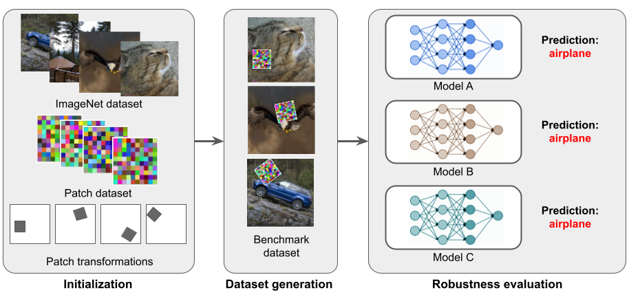
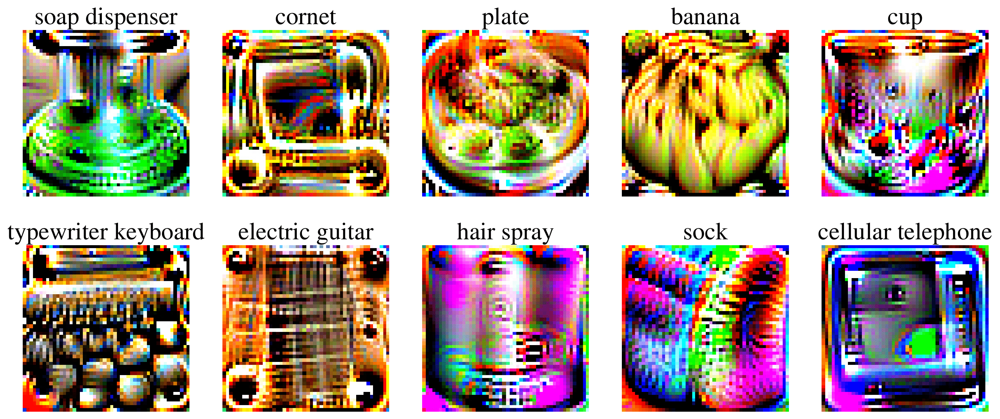
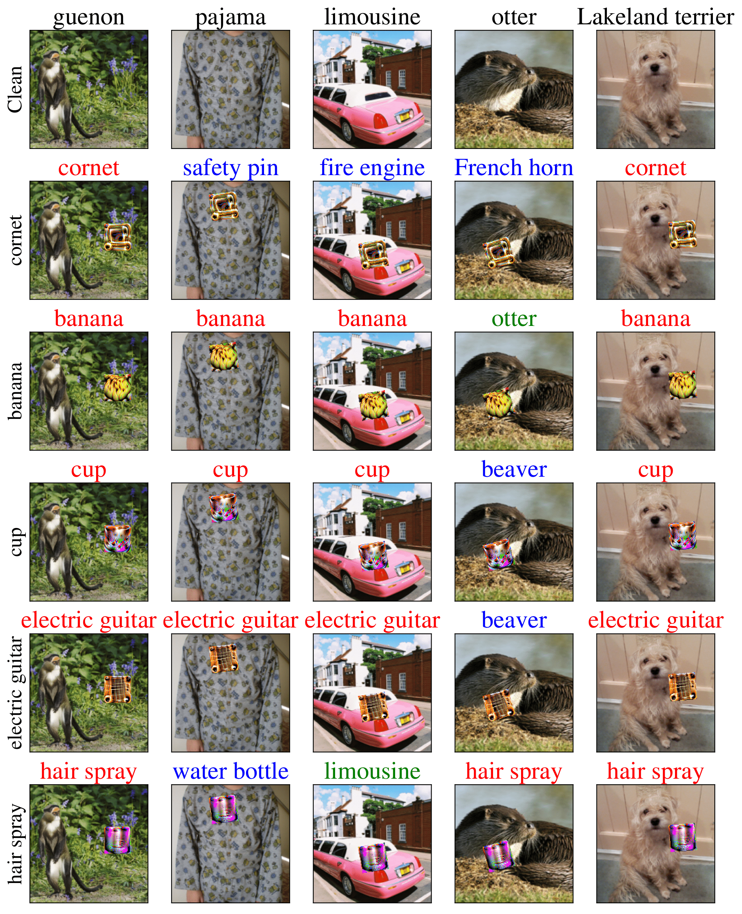

# **ImageNet-Patch: A Dataset for Benchmarking Machine Learning Robustness against Adversarial Patches**

The demo code for the application of the generated patches on a batch from the Imagenet dataset.

<p align="center">
     
</p>

## :world_map: Documentation

**Paper**: Preprint available at https://arxiv.org/abs/2203.04412

**Tutorial**: You can find a detailed example of how to use ImageNet-Patch in your model predictions in [this script](./example.py) and our [tutorial notebook](./imagenet_patch_example.ipynb).

# :joystick: Example

### How can I load the patches?

<p align="center">
     
</p>

You can find the patches saved in assets/patches.gz in the form (patches, targets),
where patches and targets are pytorch tensors respectively with shape (10, 3, 224, 224) and (10,).
To load them you can simply run the following code snippet and select your favourite one :)

```python
# Load the patches
with gzip.open(os.path.join(os.getcwd(), "assets/patches.gz"), 'rb') as f:
    patches, targets = pickle.load(f)
patch = patches[1]  # get the patch with id=1
target = targets[1]
```


### How can I use them to make predictions?

Once a patch is selected it can be used 
instantiating the ApplyPatch module in the preprocessing stack, just before the normalizer!
To do that you have to specify the patch tensor and the affine transformations
ranges (translation_range, rotation_range, scale_range), for which the parameters will be random sampled when an image is taken.


```python
from transforms.apply_patch import ApplyPatch
from torchvision.transforms import Resize, CenterCrop, ToTensor, Normalize, Compose

# Instantiate the ApplyPatch layer, setting patch, target and transforms
apply_patch = ApplyPatch(patch,
                         translation_range=(.2, .2),    # translation fraction wrt image dimensions
                         rotation_range=45,             # maximum absolute value of the rotation in degree
                         scale_range=(0.5, 1)           # scale range wrt image dimensions
                         )

# Build the preprocessing stack with ApplyPatch before the normalization step
preprocess = Compose([Resize(256), CenterCrop(224), ToTensor(),
                      apply_patch,
                      Normalize(mean=[0.485, 0.456, 0.406],
                                std=[0.229, 0.224, 0.225])
                      ])
```


<p align="center">
     
</p>

# :newspaper: Citation

If you use Imagenet-Patch in your work, please cite us using the following BibTeX entry:

```
@article{Pintor2022ImageNetPatchAD,
  title={ImageNet-Patch: A Dataset for Benchmarking Machine Learning Robustness against Adversarial Patches},
  author={Maura Pintor and Daniele Angioni and Angelo Sotgiu and Luca Demetrio and Ambra Demontis and Battista Biggio and Fabio Roli},
  journal={ArXiv},
  year={2022},
  volume={abs/2203.04412}
}
```
